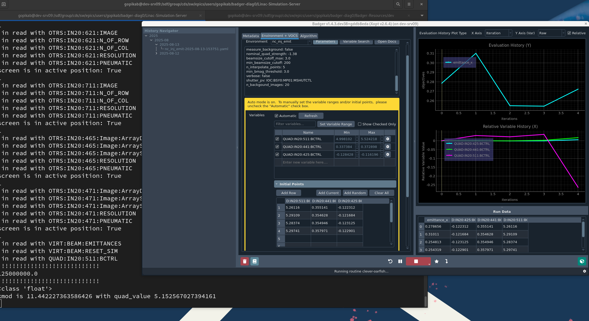

# Simulated Linac using Cheetah and PCASpy

This project provides a simulated EPICS server that hosts PVs using PCASpy. The simulation is designed to work with the Cheetah accelerator framework and includes examples for interfacing with the lcls-tools.

## Setup Instructions

To set up and run the simulated server, follow these steps:

### Setting up the environment:

```sh
$ git clone https://github.com/slaclab/Linac-Simulation-Server.git
$ cd Linac-Simulation-Server/yaml_configs
$ source /sdf/group/cds/sw/epics/users/ernesto/sandbox/ML_Physics/conda-local-activate.sh
$ conda env create -f environment.yml
$ conda activate linac-simulation
$ source /afs/slac/g/lcls/tools/script/ENVS64.bash
```

### Run the simulated server:

```
$ ./start.sh
```

### Accessing PVs

On a separate terminal, the epics-env.sh script will setup your environment appropriately to access the PVs exported by the server.

Make sure you source this script before attempting to access PVs using caget/pvget, or tools like Badger.

```
$ cd Linac-Simulation-Server/
$ source /afs/slac/g/lcls/tools/script/ENVS64.bash
$ source epics-env.sh
```
It is _not_ necessary to source epics_env.sh before running `start.sh`, as that setup is handled automatically by `start.sh`

#### Badger

```
$ source /sdf/sw/epics/package/anaconda/envs/rhel7_devel/bin/activate
$ cd Badger-Resources/cu_hxr
$ badger -g -cf config.yaml
```

Please update config.yaml with correct paths. Choose nc_inj_emit environment. Choose process variables and use emittance_x as objective. Before pressing run, set measure_background to false. 

<br/>

<br/><br/>

**Warning** Not all PVs are currently supported in the Linac Simulation Server.

## Examples:

This repository includes example scripts demonstrating how to interface with the simulated EPICS server using the lcls-tools module, which is available in the provided environment. These examples illustrate how to read from and write to process variables (PVs).

## Dependencies:

The required dependencies are listed in environment.yml, ensuring a reproducible setup. The environment includes:

PCASpy for hosting EPICS PVs

Cheetah for beam simulation

lcls-tools for interfacing with EPICS

## Additional Notes

Ensure that all dependencies are installed properly and that the `epics-env.sh` script is sourced before trying to access PVs exported by the server. Otherwise, you may unexpectedly
access PVs exported by real IOCs on the DEV or PROD networks (depending on your gateway settings).

For any issues, verify that the required environment is activated and that caget and caput can communicate with the hosted PVs.

You will also need to provide your own beam distribution (this setup is designed to run on the LCLS-I Cu Injector)
